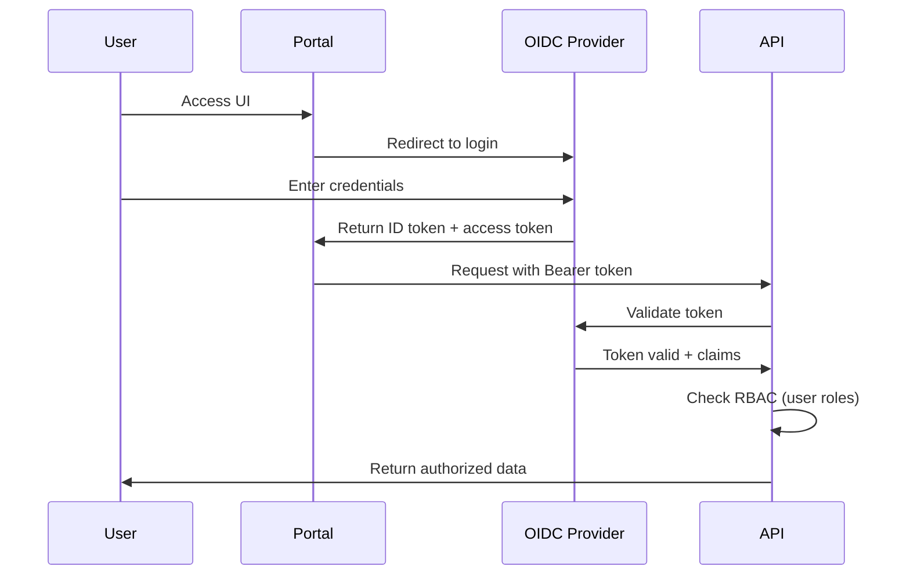

# Multi-Tenancy Platform - Design Document

## Architecture Overview

### System Components

```
┌─────────────────────────────────────────────────────────────────┐
│                      Kubernetes Cluster                         │
│                                                                 │
│  ┌──────────────┐         ┌──────────────┐                    │
│  │   Platform   │         │   Tenant     │                    │
│  │  Namespace   │         │  Namespace   │  (Multiple)        │
│  │              │         │  (Isolated)  │                    │
│  │  ┌────────┐  │         │              │                    │
│  │  │Operator│  │         │ ┌──────────┐ │                    │
│  │  │        │◄─┼─────────┼─┤ Stellar  │ │                    │
│  │  │ Main   │  │         │ │   Nodes  │ │                    │
│  │  │Controller│ │         │ └──────────┘ │                    │
│  │  └────┬───┘  │         │              │                    │
│  │       │      │         │ ┌──────────┐ │                    │
│  │  ┌────▼───┐  │         │ │ Resource │ │                    │
│  │  │ Tenant │◄─┼─────────┼─┤  Quota   │ │                    │
│  │  │Controller│ │         │ └──────────┘ │                    │
│  │  └────┬───┘  │         │              │                    │
│  │       │      │         │ ┌──────────┐ │                    │
│  │  ┌────▼───┐  │         │ │ Network  │ │                    │
│  │  │  Cost  │  │         │ │ Policies │ │                    │
│  │  │Collector│  │         │ └──────────┘ │                    │
│  │  └────────┘  │         └──────────────┘                    │
│  │              │                                              │
│  │  ┌────────┐  │         ┌──────────────┐                    │
│  │  │Webhook │◄─┼─────────┤  Admission   │                    │
│  │  │ Server │  │         │   Control    │                    │
│  │  └────────┘  │         └──────────────┘                    │
│  │              │                                              │
│  │  ┌────────┐  │                                              │
│  │  │ Portal │  │         ┌──────────────┐                    │
│  │  │  API   │◄─┼─────────┤  OIDC/RBAC   │                    │
│  │  └───┬────┘  │         └──────────────┘                    │
│  └──────┼───────┘                                              │
│         │                                                      │
│         ▼                                                      │
│  ┌─────────────┐          ┌──────────────┐                    │
│  │  Grafana    │          │  Prometheus  │                    │
│  │ (Per-Tenant │◄─────────┤  (Metrics)   │                    │
│  │ Dashboards) │          └──────────────┘                    │
│  └─────────────┘                                              │
│                                                                 │
└─────────────────────────────────────────────────────────────────┘
           │
           ▼
  ┌─────────────────┐
  │   Web Portal    │
  │  (React UI)     │
  │                 │
  │ Tenant Admins   │
  └─────────────────┘
```

### Component Responsibilities

#### 1. Tenant Controller (`src/controller/tenant_controller.rs`)

**Purpose**: Reconcile `Tenant` CRD to provision and manage tenant resources.

**Responsibilities**:
- Create/manage tenant namespace with isolation labels
- Apply ResourceQuota based on `spec.quota`
- Generate NetworkPolicies for tenant isolation
- Create tenant-scoped RBAC (RoleBindings)
- Provision Grafana dashboards
- Handle tenant lifecycle (provision, suspend, terminate)
- Update status with resource state and quota usage

**Reconciliation Logic**:
```rust
async fn reconcile_tenant(tenant: Arc<Tenant>, ctx: Arc<Context>) -> Result<Action> {
    // 1. Handle deletion (finalizer)
    if is_being_deleted(&tenant) {
        return cleanup_tenant(tenant, ctx).await;
    }
    
    // 2. Ensure namespace exists
    ensure_tenant_namespace(&ctx.client, &tenant).await?;
    
    // 3. Apply ResourceQuota
    ensure_resource_quota(&ctx.client, &tenant).await?;
    
    // 4. Apply NetworkPolicies
    ensure_network_policies(&ctx.client, &tenant).await?;
    
    // 5. Apply RBAC
    ensure_tenant_rbac(&ctx.client, &tenant).await?;
    
    // 6. Provision Grafana dashboard
    ensure_grafana_dashboard(&ctx.client, &tenant).await?;
    
    // 7. Update status
    update_tenant_status(&ctx.client, &tenant).await?;
    
    // 8. Handle lifecycle phases
    match tenant.spec.phase {
        TenantPhase::Provisioning => transition_to_active(...),
        TenantPhase::Suspended => enforce_suspension(...),
        _ => Ok(())
    }?;
    
    Ok(Action::requeue(Duration::from_secs(300)))
}
```

**Status Updates**:
```rust
struct TenantStatus {
    phase: String,  // Provisioning, Active, Suspended, Terminating
    quota_status: QuotaStatus,
    conditions: Vec<Condition>,
    dashboard_url: Option<String>,
    last_reconciled: Time,
}
```

---

#### 2. Cost Collector Job (`src/controller/cost_collector.rs`)

**Purpose**: Calculate tenant resource usage and generate cost reports.

**Responsibilities**:
- Query Prometheus for CPU/memory/storage metrics per tenant namespace
- Apply configurable cost rates (e.g., $0.10/core-hour)
- Create/update `TenantUsage` CRD with usage data
- Generate monthly cost reports
- Export to billing systems (webhook, CSV, JSON API)

**Implementation**:
```rust
pub struct CostCollector {
    client: Client,
    prometheus_url: String,
    cost_rates: CostRates,
}

#[derive(Clone)]
pub struct CostRates {
    cpu_per_core_hour: f64,      // e.g., 0.10
    memory_per_gib_hour: f64,    // e.g., 0.02
    storage_per_gib_hour: f64,   // e.g., 0.0001
}

impl CostCollector {
    pub async fn collect_usage(&self, period_start: DateTime<Utc>) -> Result<Vec<TenantUsage>> {
        let tenants = self.list_all_tenants().await?;
        let mut usages = Vec::new();
        
        for tenant in tenants {
            // Query Prometheus for CPU usage
            let cpu_query = format!(
                "sum(rate(container_cpu_usage_seconds_total{{namespace=\"{}\"}}[1h])) * 24",
                tenant.spec.namespace
            );
            let cpu_hours = self.query_prometheus(&cpu_query).await?;
            
            // Query for memory usage
            let mem_query = format!(
                "avg_over_time(sum(container_memory_working_set_bytes{{namespace=\"{}\"}})[24h:1h]) / (1024^3) * 24",
                tenant.spec.namespace
            );
            let memory_gib_hours = self.query_prometheus(&mem_query).await?;
            
            // Calculate costs
            let cpu_cost = cpu_hours * self.cost_rates.cpu_per_core_hour;
            let memory_cost = memory_gib_hours * self.cost_rates.memory_per_gib_hour;
            
            let usage = TenantUsage {
                tenant_id: tenant.spec.tenant_id.clone(),
                period_start,
                cpu_core_hours: cpu_hours,
                memory_gib_hours: memory_gib_hours,
                total_cost: cpu_cost + memory_cost,
            };
            
            usages.push(usage);
        }
        
        Ok(usages)
    }
}
```

**Cron Job Spec**:
```yaml
apiVersion: batch/v1
kind: CronJob
metadata:
  name: tenant-cost-collector
spec:
  schedule: "0 2 * * *"  # Daily at 2 AM
  jobTemplate:
    spec:
      template:
        spec:
          containers:
          - name: collector
            image: stellar-operator:latest
            command: ["stellar-operator", "cost-collector"]
            env:
            - name: PROMETHEUS_URL
              value: "http://prometheus:9090"
```

---

#### 3. Webhook Tenant Validation (`src/webhook/tenant_validator.rs`)

**Purpose**: Validate StellarNode creation/updates against tenant quotas and policies.

**Integration Point**: Extend existing `webhook/server.rs` to add tenant-aware validation.

**Validation Flow**:
```rust
pub async fn validate_stellar_node_for_tenant(
    client: &Client,
    node: &StellarNode,
) -> Result<AdmissionResponse> {
    let namespace = node.namespace().unwrap_or_default();
    
    // 1. Fetch Tenant for this namespace
    let tenant = get_tenant_for_namespace(client, &namespace).await?;
    
    // 2. Check tenant phase
    if tenant.spec.suspended {
        return deny("Tenant is suspended; cannot create new nodes");
    }
    
    // 3. Check quota would be exceeded
    let current_usage = get_current_resource_usage(client, &namespace).await?;
    let requested = calculate_node_resources(node);
    
    if current_usage.cpu + requested.cpu > tenant.spec.quota.cpu {
        return deny(format!(
            "Tenant CPU quota exceeded: {}/{} cores used",
            current_usage.cpu, tenant.spec.quota.cpu
        ));
    }
    
    // 4. Validate tenant-specific security policies
    if let Some(policy) = &tenant.spec.security_policy {
        validate_image_registry(node, &policy.registry_allowlist)?;
        validate_required_labels(node, &policy.required_labels)?;
    }
    
    // 5. Allow if all checks pass
    Ok(AdmissionResponse::allowed())
}
```

**Metrics**:
```rust
pub static TENANT_ADMISSION_DENIALS_TOTAL: Lazy<Family<TenantDenialLabels, Counter>> = ...;

#[derive(EncodeLabelSet)]
struct TenantDenialLabels {
    tenant_id: String,
    reason: String,  // "quota_exceeded", "suspended", "policy_violation"
}
```

---

#### 4. Portal REST API (`src/api/server.rs`)

**Purpose**: Provide HTTP API for tenant self-service management.

**Technology Stack**:
- **Framework**: Axum (already used in webhook server)
- **Auth**: OAuth2/OIDC (support Google, Okta, Azure AD)
- **RBAC**: Role-based access (platform-admin, tenant-admin, tenant-viewer)
- **Database**: None (direct Kubernetes API queries)

**API Routes**:
```rust
use axum::{Router, routing::{get, post, patch}};

pub fn api_routes() -> Router {
    Router::new()
        // Tenant management
        .route("/api/v1/tenants", get(list_tenants).post(create_tenant))
        .route("/api/v1/tenants/:id", get(get_tenant).patch(update_tenant))
        .route("/api/v1/tenants/:id/usage", get(get_tenant_usage))
        .route("/api/v1/tenants/:id/costs", get(get_tenant_costs))
        
        // Node management (tenant-scoped)
        .route("/api/v1/tenants/:id/nodes", get(list_tenant_nodes).post(create_node))
        .route("/api/v1/tenants/:id/nodes/:name", get(get_node).patch(update_node).delete(delete_node))
        
        // Usage reports
        .route("/api/v1/reports/usage", get(generate_usage_report))
        .route("/api/v1/reports/costs", get(generate_cost_report))
        
        // Health
        .route("/health", get(health_check))
}
```

**Authentication Middleware**:
```rust
use axum::middleware;

pub async fn auth_middleware(
    State(state): State<ApiState>,
    headers: HeaderMap,
    request: Request<Body>,
    next: Next,
) -> Result<Response, StatusCode> {
    // Extract Bearer token
    let token = headers.get("Authorization")
        .and_then(|h| h.to_str().ok())
        .and_then(|s| s.strip_prefix("Bearer "))
        .ok_or(StatusCode::UNAUTHORIZED)?;
    
    // Validate with OIDC provider
    let claims = state.oidc_client.verify_token(token).await
        .map_err(|_| StatusCode::UNAUTHORIZED)?;
    
    // Attach user info to request extensions
    request.extensions_mut().insert(UserInfo {
        id: claims.sub,
        email: claims.email,
        roles: claims.groups,
    });
    
    Ok(next.run(request).await)
}
```

**Authorization (RBAC)**:
```rust
pub enum Role {
    PlatformAdmin,  // Can manage all tenants
    TenantAdmin,    // Can manage specific tenant and its nodes
    TenantViewer,   // Read-only access to specific tenant
}

pub async fn check_tenant_access(
    user: &UserInfo,
    tenant_id: &str,
    required_role: Role,
) -> Result<(), StatusCode> {
    // Check if user has platform admin role
    if user.roles.contains(&"platform-admin".to_string()) {
        return Ok(());
    }
    
    // Check tenant-specific role
    let tenant_role = format!("tenant-{}-{}", tenant_id, role_suffix(required_role));
    if !user.roles.contains(&tenant_role) {
        return Err(StatusCode::FORBIDDEN);
    }
    
    Ok(())
}
```

**Example Handler**:
```rust
pub async fn create_node(
    State(state): State<ApiState>,
    Path(tenant_id): Path<String>,
    Extension(user): Extension<UserInfo>,
    Json(spec): Json<StellarNodeSpec>,
) -> Result<Json<StellarNode>, StatusCode> {
    // Check authorization
    check_tenant_access(&user, &tenant_id, Role::TenantAdmin).await?;
    
    // Get tenant
    let tenant = state.get_tenant(&tenant_id).await
        .map_err(|_| StatusCode::NOT_FOUND)?;
    
    // Check quota
    let quota_ok = check_quota_available(&state.client, &tenant, &spec).await?;
    if !quota_ok {
        return Err(StatusCode::FORBIDDEN); // Quota exceeded
    }
    
    // Create node
    let node = StellarNode {
        metadata: ObjectMeta {
            name: Some(format!("{}-{}", tenant_id, spec.name)),
            namespace: Some(tenant.spec.namespace.clone()),
            labels: tenant_labels(&tenant),
            ..Default::default()
        },
        spec,
        status: None,
    };
    
    let api: Api<StellarNode> = Api::namespaced(
        state.client.clone(),
        &tenant.spec.namespace
    );
    
    let created = api.create(&PostParams::default(), &node).await
        .map_err(|_| StatusCode::INTERNAL_SERVER_ERROR)?;
    
    Ok(Json(created))
}
```

---

#### 5. Portal Frontend (`portal/ui/`)

**Technology Stack**:
- **Framework**: React 18 with TypeScript
- **Build Tool**: Vite
- **UI Library**: TailwindCSS + shadcn/ui
- **State Management**: Zustand (lightweight)
- **API Client**: Axios with interceptors for auth
- **Charts**: Recharts (for usage/cost graphs)

**Page Structure**:
```
/portal
  /src
    /pages
      Dashboard.tsx          # Tenant overview
      Nodes.tsx              # Node list/create/edit
      Usage.tsx              # Usage metrics
      Costs.tsx              # Cost reports
      Settings.tsx           # Tenant settings
      Admin.tsx              # Platform admin (multi-tenant view)
    /components
      NodeCard.tsx           # Display single node
      QuotaGauge.tsx         # Quota utilization gauge
      CostChart.tsx          # Cost trend line chart
      CreateNodeDialog.tsx   # Modal for node creation
    /api
      client.ts              # Axios client with auth
      tenants.ts             # Tenant API calls
      nodes.ts               # Node API calls
      costs.ts               # Cost API calls
    /hooks
      useAuth.ts             # OIDC auth hook
      useTenants.ts          # Tenant data fetching
      useNodes.ts            # Node data fetching
    /lib
      auth.ts                # Auth utilities
      formatters.ts          # Data formatting (currency, units)
```

**Example Dashboard Component**:
```typescript
export function Dashboard() {
  const { tenant, loading } = useTenant();
  const { nodes } = useNodes(tenant?.id);
  const { usage } = useUsage(tenant?.id);
  
  if (loading) return <Spinner />;
  
  return (
    <div className="space-y-6">
      <h1 className="text-3xl font-bold">Tenant: {tenant.name}</h1>
      
      {/* Quota Cards */}
      <div className="grid grid-cols-1 md:grid-cols-3 gap-4">
        <QuotaCard 
          title="CPU Cores"
          used={usage.cpu}
          total={tenant.quota.cpu}
          unit="cores"
        />
        <QuotaCard 
          title="Memory"
          used={usage.memory}
          total={tenant.quota.memory}
          unit="GiB"
        />
        <QuotaCard 
          title="Storage"
          used={usage.storage}
          total={tenant.quota.storage}
          unit="GiB"
        />
      </div>
      
      {/* Node List */}
      <Card>
        <CardHeader>
          <CardTitle>Stellar Nodes</CardTitle>
          <Button onClick={() => navigate('/nodes/create')}>
            + Create Node
          </Button>
        </CardHeader>
        <CardContent>
          <NodeTable nodes={nodes} />
        </CardContent>
      </Card>
      
      {/* Cost Summary */}
      <Card>
        <CardHeader>
          <CardTitle>Cost This Month</CardTitle>
        </CardHeader>
        <CardContent>
          <CostChart data={usage.costHistory} />
          <p className="text-2xl font-bold mt-4">
            ${usage.currentMonthCost.toFixed(2)}
          </p>
        </CardContent>
      </Card>
    </div>
  );
}
```

---

## Data Model

### Enhanced Tenant CRD

```yaml
apiVersion: stellar.org/v1alpha1
kind: Tenant
metadata:
  name: acme-corp
spec:
  tenantId: acme-corp
  displayName: "ACME Corporation"
  
  # Namespace isolation
  namespace: acme-corp-stellar
  
  # Hierarchical structure
  hierarchy:
    parentTenantId: null           # null for root tenant
    isOrganization: true           # Can have child tenants
  
  # Resource quotas
  quota:
    hard:
      cpu: "32"
      memory: "128Gi"
      storage: "5Ti"
      persistentvolumeclaims: "20"
      stellar.org/validators: "4"
      stellar.org/horizon-nodes: "10"
  
  # Lifecycle
  suspended: false
  cleanupOnDelete: true
  
  # Security policies
  securityPolicy:
    podSecurityStandard: restricted
    requiredLabels:
      - cost-center
      - environment
    imageRegistryAllowlist:
      - "docker.io/stellar/*"
      - "gcr.io/acme-corp/*"
  
  # Billing
  billing:
    costCenter: "eng-blockchain"
    billingEmail: "finance@acme.com"
    webhookUrl: "https://billing.acme.com/api/stellar-usage"
  
  # Contact
  contacts:
    adminEmail: "stellar-admins@acme.com"
    slackChannel: "#stellar-ops"
  
  # Grafana
  dashboard:
    enabled: true
    grafanaNamespace: monitoring

status:
  # Lifecycle phase
  phase: Active  # Provisioning | Active | Suspended | Terminating
  
  # Quota status
  quotaStatus:
    hard:
      cpu: "32"
      memory: "128Gi"
    used:
      cpu: "24"
      memory: "96Gi"
    remaining:
      cpu: "8"
      memory: "32Gi"
  
  # Hierarchy
  hierarchy:
    childTenants: ["acme-dev", "acme-staging"]
    totalChildQuota:
      cpu: "16"
      memory: "64Gi"
  
  # Resources
  namespaceCreated: true
  quotaCreated: true
  networkPoliciesCreated: true
  rbacCreated: true
  dashboardUrl: "https://grafana.example.com/d/tenant-acme-corp"
  
  # Timestamps
  lastReconciled: "2026-06-02T10:30:00Z"
  provisionedAt: "2026-06-01T14:20:00Z"
  
  # Conditions
  conditions:
    - type: Ready
      status: "True"
      reason: FullyProvisioned
      message: "All tenant resources are healthy"
    - type: QuotaHealthy
      status: "False"
      reason: HighUtilization
      message: "CPU quota at 75% utilization"
```

### TenantUsage CRD

```yaml
apiVersion: stellar.org/v1alpha1
kind: TenantUsage
metadata:
  name: acme-corp-2026-06
  namespace: stellar-system
spec:
  tenantId: acme-corp
  period:
    start: "2026-06-01T00:00:00Z"
    end: "2026-06-30T23:59:59Z"

status:
  # Raw usage
  resources:
    cpuCoreHours: 14400        # 600 core-hours/day * 24 days
    memoryGiBHours: 57600      # 2400 GiB-hours/day * 24 days
    storageGiBHours: 1200000   # 50TB-hours/day * 24 days
  
  # Costs
  costs:
    cpu: 1440.00               # 14400 * $0.10
    memory: 1152.00            # 57600 * $0.02
    storage: 120.00            # 1200000 * $0.0001
    total: 2712.00
  
  # Per-node breakdown
  breakdown:
    - nodeName: validator-1
      nodeType: Validator
      cpuCoreHours: 4800
      memorGiBHours: 19200
      cost: 864.00
    - nodeName: horizon-1
      nodeType: Horizon
      cpuCoreHours: 2400
      memoryGiBHours: 9600
      cost: 432.00
  
  # Generated report
  reportGenerated: true
  reportUrl: "https://billing.example.com/reports/acme-corp-2026-06.pdf"
```

---

## Network Isolation Architecture

### Tenant Namespace Labels

Every tenant namespace gets these labels:
```yaml
apiVersion: v1
kind: Namespace
metadata:
  name: acme-corp-stellar
  labels:
    tenant.stellar.org/id: acme-corp
    tenant.stellar.org/parent: null  # or parent tenant ID
    stellar.org/network: mainnet     # Reuse existing isolation
```

### Default NetworkPolicy per Tenant

```yaml
apiVersion: networking.k8s.io/v1
kind: NetworkPolicy
metadata:
  name: tenant-isolation
  namespace: acme-corp-stellar
spec:
  podSelector: {}  # Apply to all pods in namespace
  policyTypes:
  - Ingress
  - Egress
  
  # Ingress rules
  ingress:
  # Allow from same namespace
  - from:
    - podSelector: {}
  
  # Allow from ingress controller
  - from:
    - namespaceSelector:
        matchLabels:
          kubernetes.io/metadata.name: ingress-nginx
  
  # Allow from monitoring
  - from:
    - namespaceSelector:
        matchLabels:
          kubernetes.io/metadata.name: monitoring
    ports:
    - protocol: TCP
      port: 9090  # Prometheus scrape
  
  # Egress rules
  egress:
  # Allow to same namespace
  - to:
    - podSelector: {}
  
  # Allow DNS
  - to:
    - namespaceSelector:
        matchLabels:
          kubernetes.io/metadata.name: kube-system
    ports:
    - protocol: UDP
      port: 53
  
  # Allow to Stellar network (public internet for validators)
  - to:
    - namespaceSelector: {}
    ports:
    - protocol: TCP
      port: 11625  # Stellar Core peer port
  
  # Block all other cross-namespace traffic
```

### Cross-Tenant Protection

Controller validation prevents:

1. **Cross-tenant node access**: StellarNodes cannot reference secrets/configmaps from other tenant namespaces
2. **Quota bypass**: Webhook validates total resources before allowing node creation
3. **Network leakage**: NetworkPolicies block pod-to-pod traffic across tenant boundaries

---

## Security Model

### Authentication & Authorization

#### Portal Authentication (OIDC)



#### Kubernetes RBAC per Tenant

**Tenant Admin Role**:
```yaml
apiVersion: rbac.authorization.k8s.io/v1
kind: Role
metadata:
  name: tenant-admin
  namespace: acme-corp-stellar
rules:
- apiGroups: ["stellar.org"]
  resources: ["stellarnodes"]
  verbs: ["get", "list", "create", "update", "patch", "delete"]
- apiGroups: [""]
  resources: ["pods", "services", "configmaps"]
  verbs: ["get", "list"]
- apiGroups: [""]
  resources: ["pods/log"]
  verbs: ["get"]
```

**Tenant Viewer Role**:
```yaml
apiVersion: rbac.authorization.k8s.io/v1
kind: Role
metadata:
  name: tenant-viewer
  namespace: acme-corp-stellar
rules:
- apiGroups: ["stellar.org"]
  resources: ["stellarnodes"]
  verbs: ["get", "list"]
- apiGroups: [""]
  resources: ["pods", "services"]
  verbs: ["get", "list"]
```

**Bindings**:
```yaml
apiVersion: rbac.authorization.k8s.io/v1
kind: RoleBinding
metadata:
  name: tenant-admin-binding
  namespace: acme-corp-stellar
subjects:
- kind: Group
  name: "tenant-acme-corp-admin"  # From OIDC groups
  apiGroup: rbac.authorization.k8s.io
roleRef:
  kind: Role
  name: tenant-admin
  apiGroup: rbac.authorization.k8s.io
```

### Secret Isolation

- Tenants cannot access secrets outside their namespace (enforced by Kubernetes RBAC)
- KMS keys for validators are tenant-scoped
- Tenant controller cannot read/write secrets in other tenant namespaces
- Portal API enforces tenant context on all operations

### Audit Logging

All tenant operations are logged with structured context:
```json
{
  "timestamp": "2026-06-02T10:30:00Z",
  "action": "create_stellar_node",
  "tenant_id": "acme-corp",
  "user": "alice@acme.com",
  "resource": "validator-1",
  "result": "success",
  "ip": "203.0.113.45"
}
```

Audit sinks:
- Kubernetes audit log
- Elasticsearch (optional)
- S3 bucket for compliance retention

---

## Monitoring & Observability

### Metrics

**Tenant-Level Metrics**:
```promql
# Quota utilization
stellar_tenant_quota_used{tenant_id="acme-corp", resource="cpu"}
stellar_tenant_quota_limit{tenant_id="acme-corp", resource="cpu"}

# Cost tracking
stellar_tenant_cost_daily{tenant_id="acme-corp"}
stellar_tenant_cost_monthly{tenant_id="acme-corp"}

# Node counts
stellar_tenant_node_count{tenant_id="acme-corp", node_type="Validator"}

# Admission control
stellar_tenant_admission_denials_total{tenant_id="acme-corp", reason="quota_exceeded"}
# Controller performance
stellar_tenant_reconcile_duration_seconds{tenant_id="acme-corp"}
stellar_tenant_reconcile_errors_total{tenant_id="acme-corp"}
```

**Platform-Level Metrics**:
```promql
# Total tenants
stellar_tenants_total{phase="Active"}

# Platform capacity
stellar_platform_cpu_utilization
stellar_platform_memory_utilization

# Cost collector
stellar_cost_collector_duration_seconds
stellar_cost_collector_errors_total
```

### Alerts

**Tenant Alerts** (scoped per tenant):
```yaml
groups:
- name: tenant_alerts
  rules:
  - alert: TenantQuotaNearLimit
    expr: |
      stellar_tenant_quota_used{resource="cpu"} / stellar_tenant_quota_limit{resource="cpu"} > 0.8
    for: 10m
    labels:
      severity: warning
      tenant_id: '{{ $labels.tenant_id }}'
    annotations:
      summary: "Tenant {{ $labels.tenant_id }} CPU quota at {{ $value | humanizePercentage }}"
  
  - alert: TenantQuotaExceeded
    expr: |
      stellar_tenant_quota_used{resource="cpu"} >= stellar_tenant_quota_limit{resource="cpu"}
    for: 1m
    labels:
      severity: critical
      tenant_id: '{{ $labels.tenant_id }}'
    annotations:
      summary: "Tenant {{ $labels.tenant_id }} has hit CPU quota limit"
  
  - alert: TenantNodesDegraded
    expr: |
      stellar_node_sync_status{namespace=~".*-stellar"} == 6  # Degraded phase
    for: 15m
    labels:
      severity: warning
    annotations:
      summary: "Tenant node {{ $labels.name }} is degraded"
```

**Platform Alerts**:
```yaml
groups:
- name: platform_alerts
  rules:
  - alert: TenantControllerDown
    expr: up{job="stellar-operator", controller="tenant"} == 0
    for: 5m
    labels:
      severity: critical
    annotations:
      summary: "Tenant controller is down"
  
  - alert: PortalAPIHighLatency
    expr: histogram_quantile(0.95, rate(http_request_duration_seconds_bucket[5m])) > 0.5
    for: 10m
    labels:
      severity: warning
    annotations:
      summary: "Portal API P95 latency > 500ms"
```

### Grafana Dashboards

**Per-Tenant Dashboard** (auto-provisioned):
- Panels:
  - Quota utilization gauges (CPU, memory, storage)
  - Node health status grid
  - Cost trends (daily/weekly/monthly)
  - Ledger sync lag
  - Network traffic (ingress/egress)
  - Top resource-consuming nodes
- Filters: Time range, node type, network
- Links: Direct links to Portal for node management

**Platform Dashboard** (for admins):
- Panels:
  - Total tenant count by phase
  - Platform-wide resource utilization
  - Top 10 tenants by cost
  - Controller reconciliation latency
  - Webhook admission rate and denials
  - Cost collector job status
- Filters: Tenant ID, time range

---

## Migration Strategy

### From Single-Tenant to Multi-Tenant

**Phase 1: Add Tenant CRD (Non-Breaking)**
- Deploy extended Tenant CRD
- Do NOT enable controller yet
- Existing StellarNodes continue to work

**Phase 2: Gradual Tenant Adoption**
- Create Tenant resources for existing namespaces
- Label existing namespaces with `tenant.stellar.org/id`
- Enable Tenant controller (read-only mode initially)

**Phase 3: Quota Enforcement**
- Apply ResourceQuotas to tenant namespaces
- Enable webhook tenant validation
- Monitor for quota violations

**Phase 4: Network Isolation**
- Apply NetworkPolicies to tenant namespaces
- Verify no cross-tenant traffic

**Phase 5: Portal Rollout**
- Deploy Portal API and UI
- Onboard pilot tenants
- Collect feedback and iterate

**Rollback Plan**:
- Disable webhook tenant validation
- Remove Tenant controller
- Keep existing StellarNodes (backward compatible)

---

## Testing Strategy

### Unit Tests

**Tenant Controller** (`src/controller/tenant_controller.rs`):
- Namespace creation with correct labels
- ResourceQuota calculation (including hierarchical)
- NetworkPolicy generation
- RBAC binding creation
- Status updates
- Finalizer cleanup

**Cost Collector** (`src/controller/cost_collector.rs`):
- Prometheus query construction
- Cost calculation accuracy
- TenantUsage CRD creation
- Per-node cost breakdown

**Webhook Validation** (`src/webhook/tenant_validator.rs`):
- Quota enforcement logic
- Tenant phase validation
- Security policy checks
- Error message clarity

**Portal API** (`src/api/server.rs`):
- OIDC token validation
- RBAC authorization
- Tenant resource CRUD operations
- Quota enforcement in API layer

### Integration Tests (kind cluster)

**Tenant Lifecycle**:
```rust
#[tokio::test]
async fn test_tenant_lifecycle() {
    let client = setup_test_cluster().await;
    
    // Create tenant
    let tenant = create_test_tenant(&client, "test-tenant").await;
    assert!(tenant_namespace_exists(&client, "test-tenant-stellar").await);
    
    // Create node within quota
    let node = create_stellar_node(&client, &tenant, "validator-1").await;
    assert!(node.is_ok());
    
    // Attempt to exceed quota
    let result = create_node_exceeding_quota(&client, &tenant).await;
    assert!(result.is_err());
    
    // Suspend tenant
    suspend_tenant(&client, &tenant).await;
    assert_eq!(get_node_replicas(&client, "validator-1").await, 0);
    
    // Delete tenant
    delete_tenant(&client, &tenant).await;
    assert!(!tenant_namespace_exists(&client, "test-tenant-stellar").await);
}
```

**Network Isolation**:
```rust
#[tokio::test]
async fn test_tenant_network_isolation() {
    let client = setup_test_cluster().await;
    
    let tenant_a = create_test_tenant(&client, "tenant-a").await;
    let tenant_b = create_test_tenant(&client, "tenant-b").await;
    
    let node_a = create_stellar_node(&client, &tenant_a, "node-a").await;
    let node_b = create_stellar_node(&client, &tenant_b, "node-b").await;
    
    // Verify NetworkPolicies exist
    assert!(network_policy_exists(&client, &tenant_a).await);
    assert!(network_policy_exists(&client, &tenant_b).await);
    
    // Verify cross-tenant traffic is blocked
    assert!(!can_ping_across_tenants(&client, &node_a, &node_b).await);
}
```

### E2E Tests (Cypress for Portal)

**User Flows**:
- Login via OIDC → View dashboard → See quota usage
- Create new StellarNode → Verify appears in UI
- Attempt to create node exceeding quota → See error message
- View cost report → Export CSV
- Admin: Create new tenant → Provision namespace

### Load Tests (k6)

**Scenarios**:
1. **Concurrent Node Creation**: 100 tenants each creating 10 nodes simultaneously
2. **Webhook Throughput**: 100 admission requests/second for 5 minutes
3. **Portal API Load**: 1000 concurrent users browsing dashboards
4. **Cost Calculation**: Process 1000 TenantUsage records in <30 seconds

**Success Criteria**:
- No quota bypass under load
- Controller reconciliation P95 < 5s
- Webhook P99 < 100ms
- Portal API P95 < 500ms
- Zero crashes or OOMs

---

## Deployment Architecture

### Operator Components

```yaml
apiVersion: apps/v1
kind: Deployment
metadata:
  name: stellar-operator
  namespace: stellar-system
spec:
  replicas: 2  # HA with leader election
  selector:
    matchLabels:
      app: stellar-operator
  template:
    metadata:
      labels:
        app: stellar-operator
    spec:
      serviceAccountName: stellar-operator
      containers:
      - name: operator
        image: stellar-operator:v2.0.0
        command: ["stellar-operator", "controller"]
        env:
        - name: RUST_LOG
          value: "info,stellar_operator=debug"
        - name: ENABLE_TENANT_CONTROLLER
          value: "true"
        resources:
          requests:
            cpu: "500m"
            memory: "512Mi"
          limits:
            cpu: "2"
            memory: "2Gi"
```

### Portal Deployment

```yaml
apiVersion: apps/v1
kind: Deployment
metadata:
  name: stellar-portal-api
  namespace: stellar-system
spec:
  replicas: 2
  selector:
    matchLabels:
      app: stellar-portal-api
  template:
    metadata:
      labels:
        app: stellar-portal-api
    spec:
      containers:
      - name: api
        image: stellar-portal-api:v1.0.0
        ports:
        - containerPort: 8080
        env:
        - name: OIDC_ISSUER_URL
          value: "https://accounts.google.com"
        - name: OIDC_CLIENT_ID
          valueFrom:
            secretKeyRef:
              name: portal-oidc
              key: client-id
        resources:
          requests:
            cpu: "200m"
            memory: "256Mi"
---
apiVersion: apps/v1
kind: Deployment
metadata:
  name: stellar-portal-ui
spec:
  replicas: 2
  selector:
    matchLabels:
      app: stellar-portal-ui
  template:
    spec:
      containers:
      - name: ui
        image: stellar-portal-ui:v1.0.0
        ports:
        - containerPort: 80
```

### Cost Collector CronJob

```yaml
apiVersion: batch/v1
kind: CronJob
metadata:
  name: tenant-cost-collector
  namespace: stellar-system
spec:
  schedule: "0 2 * * *"  # Daily at 2 AM UTC
  jobTemplate:
    spec:
      template:
        spec:
          serviceAccountName: cost-collector
          restartPolicy: OnFailure
          containers:
          - name: collector
            image: stellar-operator:v2.0.0
            command: ["stellar-operator", "cost-collector"]
            env:
            - name: PROMETHEUS_URL
              value: "http://prometheus.monitoring:9090"
            - name: CPU_COST_PER_CORE_HOUR
              value: "0.10"
            - name: MEMORY_COST_PER_GIB_HOUR
              value: "0.02"
            resources:
              requests:
                cpu: "100m"
                memory: "128Mi"
```

---

## Open Questions & Decisions

### Q1: Grafana Provisioning Strategy?

**Options**:
1. **ConfigMap approach**: Controller writes dashboard JSON to ConfigMap, Grafana sidecar picks it up
2. **Grafana API**: Controller makes HTTP calls to Grafana API to create dashboards
3. **Grafana Operator**: Use Grafana Operator CRD (`GrafanaDashboard`)

**Decision**: Start with **Grafana Operator** (cleanest, most declarative).

### Q2: Cost Rates Configuration?

**Options**:
1. Hard-coded in operator binary
2. ConfigMap (runtime updates)
3. Per-tenant cost rates (in `TenantSpec`)

**Decision**: **ConfigMap** for global defaults, with optional per-tenant overrides in `TenantSpec.billing.costRates`.

### Q3: Hierarchical Quota Enforcement?

**Question**: Should parent tenant quota be sum of children, or separate allocation?

**Decision**: **Separate allocation**. Parent has own quota for direct usage, and also tracks total child allocation. Children cannot exceed parent's available quota.

Example:
- Parent quota: 32 cores
- Parent direct usage: 8 cores
- Child A allocated: 12 cores
- Child B allocated: 10 cores
- Remaining for new children: 32 - 8 - 12 - 10 = 2 cores

### Q4: Webhook Performance at Scale?

**Concern**: Querying ResourceQuota status on every admission adds latency.

**Mitigations**:
1. **Cache ResourceQuota** in webhook server (refresh every 10s)
2. **Parallel validations**: Run org standards + tenant checks concurrently
3. **Fast-path for dry-run**: Skip expensive checks for `dry_run=true` requests

**Decision**: Implement caching with TTL, accept eventual consistency (10s max staleness).

### Q5: Multi-Cluster Tenancy?

**Question**: Should tenants span multiple Kubernetes clusters?

**Decision**: **Out of scope for v1**. Focus on single-cluster multi-tenancy first. Multi-cluster can be added in v2 leveraging existing `CrossClusterConfig` patterns.

---

## Implementation Checklist

### Phase 1: Foundation (Week 1-2)
- [ ] Extend `Tenant` CRD schema
- [ ] Implement `TenantController` reconciliation loop
- [ ] Add finalizer for tenant cleanup
- [ ] Create namespace with isolation labels
- [ ] Generate and apply ResourceQuota
- [ ] Generate and apply NetworkPolicies
- [ ] Generate and apply RBAC (Role + RoleBinding)
- [ ] Update TenantStatus with provisioning progress
- [ ] Unit tests for controller logic
- [ ] Integration test: create tenant → verify namespace + resources

### Phase 2: Quotas & Enforcement (Week 3)
- [ ] Implement quota usage calculation
- [ ] Add webhook tenant validation (`tenant_validator.rs`)
- [ ] Check tenant phase (deny if suspended)
- [ ] Check quota would be exceeded
- [ ] Validate tenant security policies
- [ ] Add metrics: `stellar_tenant_quota_used`, `stellar_tenant_admission_denials_total`
- [ ] Prometheus alerts: `TenantQuotaExceeded`, `TenantQuotaNearLimit`
- [ ] Integration test: exceed quota → verify denial

### Phase 3: Cost Tracking (Week 4)
- [ ] Define `TenantUsage` CRD
- [ ] Implement `CostCollector` job
- [ ] Query Prometheus for resource usage
- [ ] Calculate costs with configurable rates
- [ ] Generate per-node cost breakdown
- [ ] Store TenantUsage resources
- [ ] Add CronJob for daily collection
- [ ] Grafana dashboard: "Tenant Cost Report"
- [ ] Unit tests for cost calculation
- [ ] Integration test: generate usage report

### Phase 4: Portal API (Week 5)
- [ ] Scaffold Axum API server (`src/api/server.rs`)
- [ ] Implement OIDC authentication middleware
- [ ] Implement RBAC authorization checks
- [ ] Tenant API endpoints (CRUD)
- [ ] Node API endpoints (tenant-scoped)
- [ ] Usage API endpoints
- [ ] Cost API endpoints
- [ ] Health check endpoint
- [ ] Prometheus metrics for API
- [ ] Helm chart for portal deployment
- [ ] Unit tests for API handlers
- [ ] Integration test: API auth + RBAC

### Phase 5: Portal UI (Week 6)
- [ ] Scaffold React + Vite project
- [ ] Implement OIDC login flow
- [ ] Dashboard page (quota usage, node count, cost summary)
- [ ] Nodes page (list, create, edit, delete)
- [ ] Usage page (metrics charts)
- [ ] Costs page (breakdown, trends, export)
- [ ] Settings page (view tenant config)
- [ ] Admin page (multi-tenant overview)
- [ ] Build Docker image for UI
- [ ] E2E tests (Cypress)

### Phase 6: Advanced Features (Week 7-8)
- [ ] Hierarchical tenancy support
  - [ ] Add `hierarchy` fields to TenantSpec
  - [ ] Implement parent-child quota validation
  - [ ] Status shows child tenants
  - [ ] Prevent parent deletion with active children
- [ ] Per-tenant Grafana dashboards
  - [ ] Implement Grafana Operator integration
  - [ ] Generate dashboard JSON per tenant
  - [ ] Write dashboard URL to TenantStatus
- [ ] Tenant-specific security policies
  - [ ] Implement policy validation in webhook
  - [ ] Image registry allowlist
  - [ ] Required labels
- [ ] Lifecycle management
  - [ ] Implement suspend/reactivate logic
  - [ ] Scale nodes to 0 on suspend
  - [ ] Block new nodes when suspended
  - [ ] Final cost report on deletion

### Phase 7: Documentation & Polish (Week 9-10)
- [ ] Architecture documentation
- [ ] Multi-tenancy setup guide
- [ ] Tenant onboarding playbook
- [ ] Cost rate configuration guide
- [ ] RBAC setup guide
- [ ] Troubleshooting runbook
- [ ] Portal user guide
- [ ] API reference docs
- [ ] Migration guide from single-tenant
- [ ] Load testing (100 tenants)
- [ ] Security review
- [ ] Performance tuning

---

## Success Criteria

✅ **Functionality**
- [ ] Create 10 tenants with different quotas
- [ ] Each tenant can deploy StellarNodes within quota
- [ ] Quota enforcement blocks exceeding limits
- [ ] Network isolation prevents cross-tenant traffic
- [ ] Cost reports are accurate (<1% error)
- [ ] Portal UI is functional and user-friendly
- [ ] Hierarchical tenancy works (parent + 2 children)

✅ **Performance**
- [ ] Tenant controller reconciles in <5s (P95)
- [ ] Webhook responds in <100ms (P99)
- [ ] Portal API responds in <500ms (P95)
- [ ] Cost collector completes in <30s for 100 tenants
- [ ] Support 100+ tenants without degradation

✅ **Security**
- [ ] Tenants cannot access other tenants' namespaces
- [ ] Tenants cannot bypass quotas
- [ ] OIDC authentication works (Google, Okta, Azure AD)
- [ ] RBAC prevents privilege escalation
- [ ] Audit logs capture all tenant operations

✅ **Reliability**
- [ ] Controller HA with leader election
- [ ] Portal HA with 2+ replicas
- [ ] No data loss on tenant deletion (if `cleanup_on_delete: false`)
- [ ] Graceful degradation if Grafana unavailable

✅ **Observability**
- [ ] All components emit Prometheus metrics
- [ ] Per-tenant Grafana dashboards work
- [ ] Platform-level Grafana dashboard works
- [ ] Alerts fire correctly for quota violations

---

## References

### External Resources
- [Kubernetes Multi-Tenancy Best Practices](https://kubernetes.io/docs/concepts/security/multi-tenancy/)
- [kube-rs Controller Tutorial](https://kube.rs/controllers/intro/)
- [Axum Web Framework](https://github.com/tokio-rs/axum)
- [Grafana Operator](https://github.com/grafana-operator/grafana-operator)
- [OIDC Discovery](https://openid.net/specs/openid-connect-discovery-1_0.html)

### Internal Codebase
- `src/crd/tenant.rs` - Existing Tenant CRD foundation
- `src/controller/reconciler.rs` - Controller patterns
- `src/controller/resources.rs` - Resource creation patterns
- `src/controller/network_isolation.rs` - Network safety checks
- `src/webhook/server.rs` - Webhook server structure
- `src/webhook/org_validator.rs` - Validation patterns
- `src/controller/metrics.rs` - Metrics instrumentation

---

## Glossary

- **Tenant**: An isolated environment for a team/organization with dedicated namespace, quotas, and policies
- **Hierarchical Tenancy**: Parent-child tenant relationships (e.g., org → team → project)
- **Quota**: Hard limits on resources (CPU, memory, storage, object counts)
- **Cost Allocation**: Tracking resource usage and calculating costs per tenant
- **Chargeback**: Billing tenants for their actual resource consumption
- **Network Isolation**: Preventing cross-tenant network traffic via NetworkPolicies
- **Admission Control**: Webhook validation before resource creation
