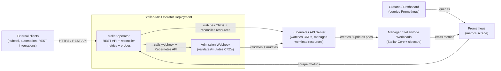
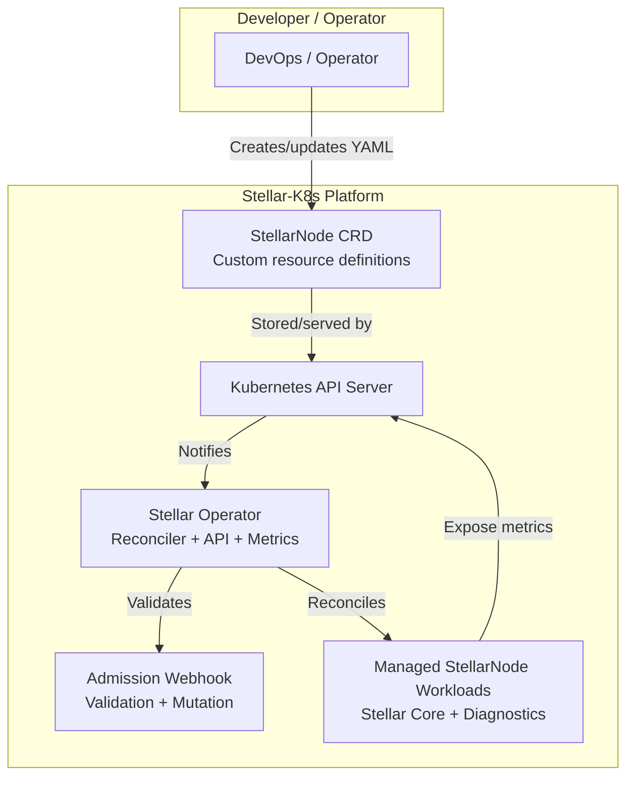

# Interactive Architecture Diagrams

## System Context

```mermaid
flowchart LR
  client["External clients\n(kubectl, automation, REST integrations)"]
  dashboard["Grafana / Dashboard\n(queries Prometheus)"]
  prom["Prometheus\n(metrics scrape)"]

  subgraph Operator[Stellar-K8s Operator Deployment]
    op["stellar-operator\nREST API + reconciler\nmetrics + probes"]
    webhook["Admission Webhook\n(validates/mutates CRDs)"]
  end

  kube["Kubernetes API Server\n(watches CRDs, manages workload resources)"]
  managed["Managed StellarNode Workloads\n(Stellar Core + sidecars)"]

  client -->|HTTPS / REST API| op
  op -->|watches CRDs + reconciles resources| kube
  kube -->|creates / updates pods| managed
  webhook -->|validates + mutates| kube
  op -->|calls webhook + Kubernetes API| webhook
  prom -->|scrape /metrics| op
  dashboard -->|queries| prom
  managed -->|emits metrics| prom
```

## C4 Component Model

```mermaid
flowchart TB
  subgraph Developer[Developer / Operator]
    user["DevOps / Operator"]
  end

  subgraph Platform[Stellar-K8s Platform]
    operator["Stellar Operator\nReconciler + API + Metrics"]
    webhook["Admission Webhook\nValidation + Mutation"]
    crd["StellarNode CRD\nCustom resource definitions"]
    controller["Kubernetes API Server"]
    workloads["Managed StellarNode Workloads\nStellar Core + Diagnostics"]
  end

  user -->|Creates/updates YAML| crd
  crd -->|Stored/served by| controller
  controller -->|Notifies| operator
  operator -->|Reconciles| workloads
  operator -->|Validates| webhook
  workloads -->|Expose metrics| controller
```
