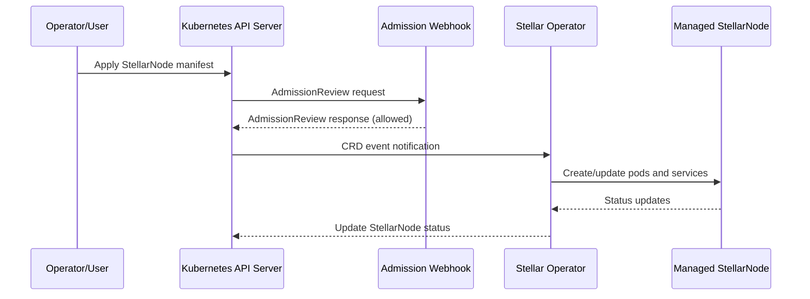
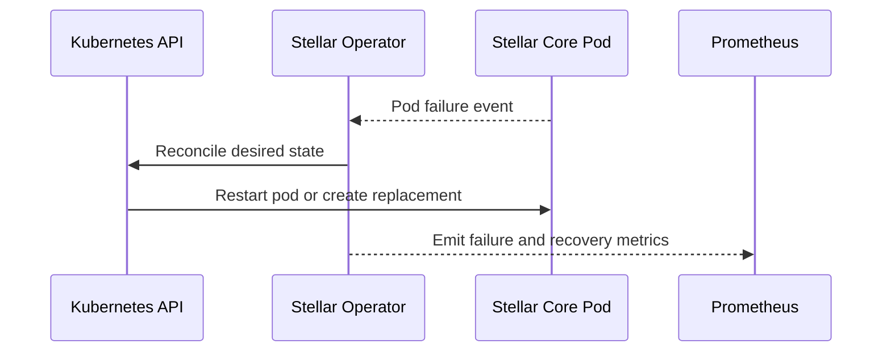

# Sequence Diagrams

## Reconciliation Workflow

```mermaid
sequenceDiagram
  participant User as Operator/User
  participant API as Kubernetes API Server
  participant Webhook as Admission Webhook
  participant Operator as Stellar Operator
  participant Workload as Managed StellarNode

  User->>API: Apply StellarNode manifest
  API->>Webhook: AdmissionReview request
  Webhook-->>API: AdmissionReview response (allowed)
  API->>Operator: CRD event notification
  Operator->>Workload: Create/update pods and services
  Workload-->>Operator: Status updates
  Operator-->>API: Update StellarNode status
```

## Failover Workflow

```mermaid
sequenceDiagram
  participant Kube as Kubernetes API
  participant Operator as Stellar Operator
  participant Workload as Stellar Core Pod
  participant Metrics as Prometheus

  Workload-->>Operator: Pod failure event
  Operator->>Kube: Reconcile desired state
  Kube->>Workload: Restart pod or create replacement
  Operator-->>Metrics: Emit failure and recovery metrics
```
